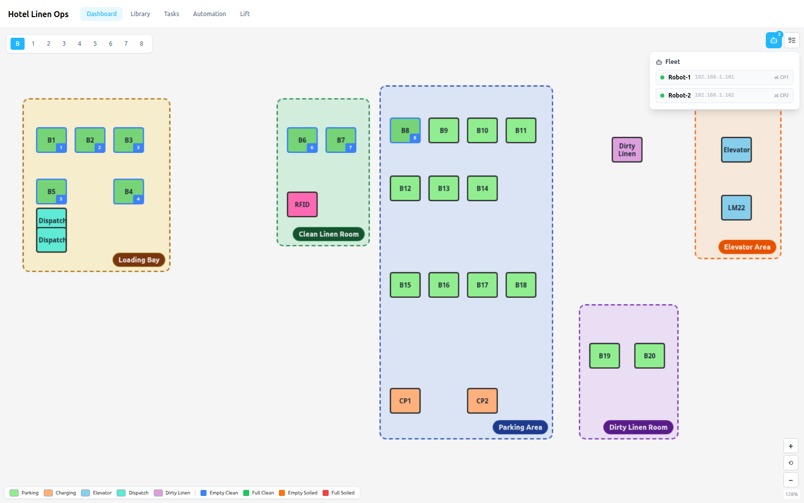
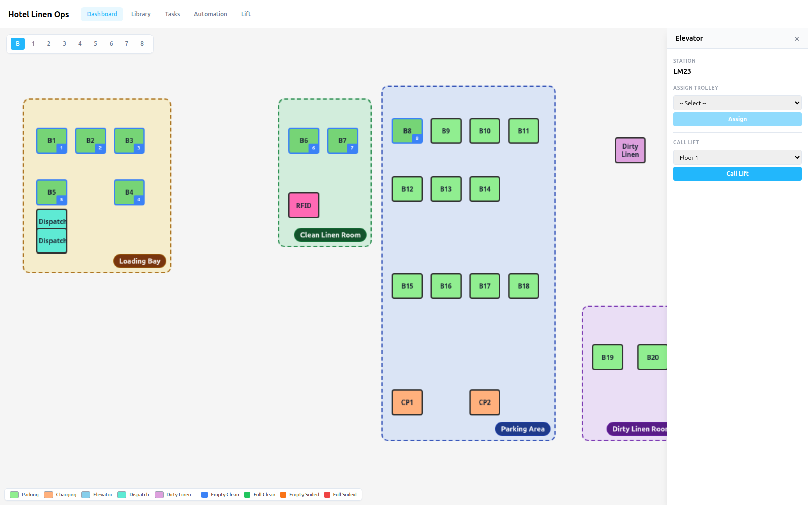
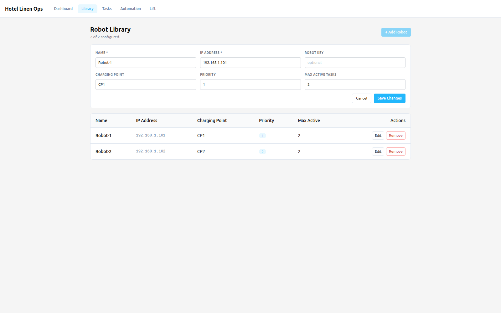
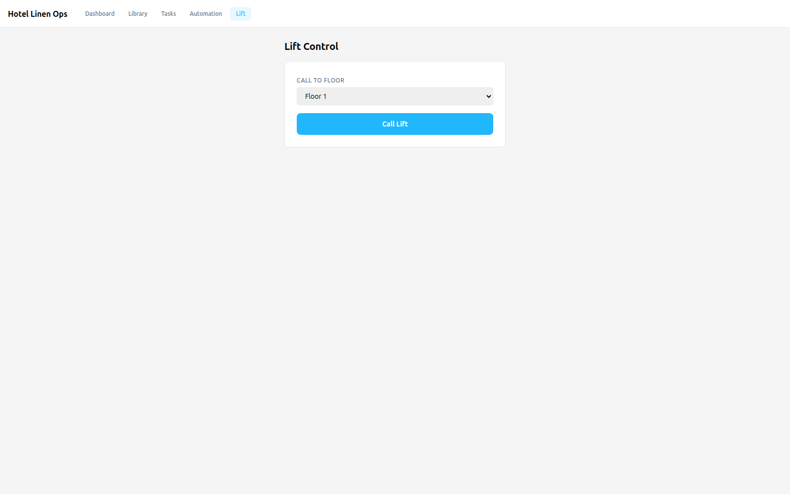

## Note

This is a sanitized public version of a production fleet management system (originally SEER TCP). Branding, facility names, and proprietary identifiers have been replaced with neutral terms. The stack and architecture match the original.

## Problem

A hotel uses autonomous mobile robots (AMRs) to ferry clean and soiled linen trolleys between the basement dispatch and ward floors. The operations team needed a unified platform to monitor robot positions on an interactive map, dispatch trolley moves, manage the fleet, control elevator/lift calls, and handle automatic door access, all without touching the underlying robotics stack's CLI.

## Solution

Built a full-stack system with a React + Vite frontend and an Elysia.js API backend on Bun. The backend communicates with robots via TCP modbus for real-time commands and status. The map screen fills the viewport with an interactive floor plan, station markers showing live trolley assignments, and a side panel for dispatching robots, calling lifts, or operating RFID cabinets and doors. The frontend was split into a separate Docker container from the backend, with Caddy as the reverse proxy handling TLS and routing.

### Dashboard with fleet popover

### Elevator station detail with Call Lift

### Robot Library (CRUD)

### Lift Control

## Outcome

A full-stack deployment running in production with a Docker Compose stack (backend API, frontend SPA, Caddy reverse proxy). The sanitized version is hosted on GitHub Pages as a single-page frontend demo with all state simulated in localStorage, demonstrating the complete operator workflow: see robot positions on the interactive map, open a station to assign a trolley and dispatch a robot, monitor the live task queue, manage the fleet from the library, and call the lift to any floor.

## Links

- [GitHub](https://github.com/alfianahar/hotel-linen-amr-ops)
- [Live Demo](https://alfianahar.github.io/hotel-linen-amr-ops/)
