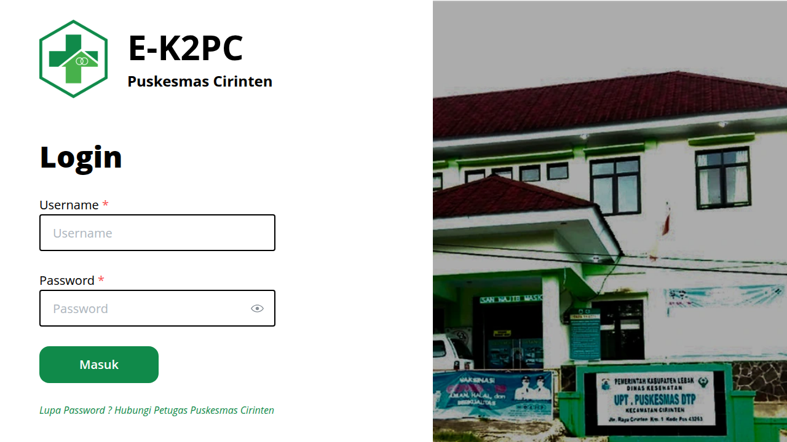
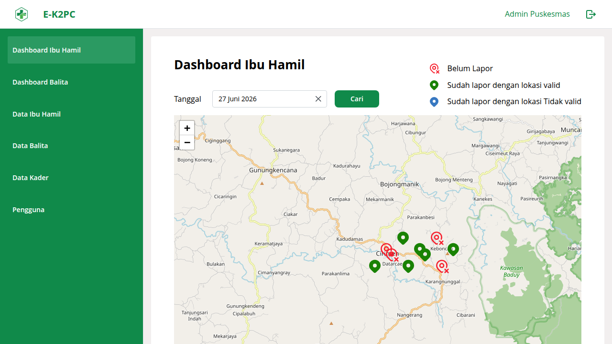
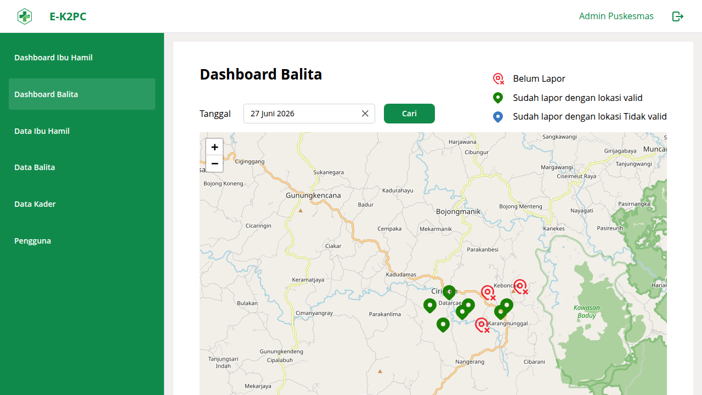
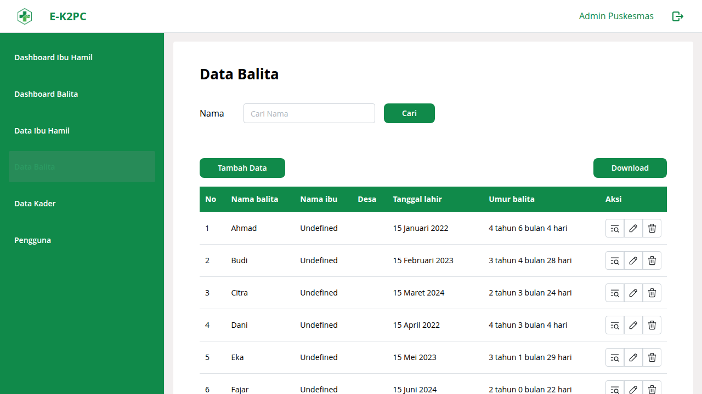
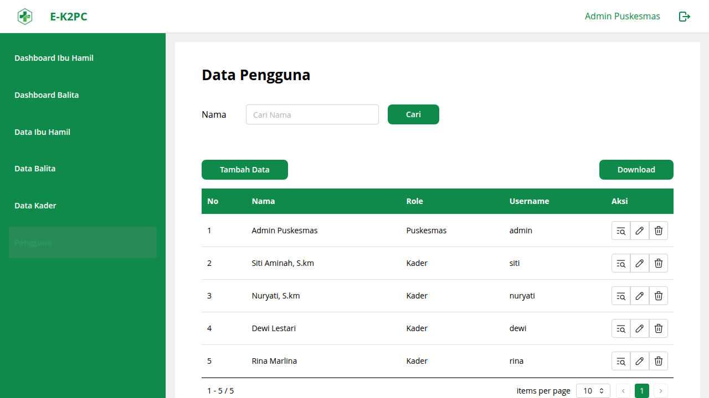

## Problem

Puskesmas Cirinten lacked a digital system to track the distribution of nutritional aid to pregnant women and toddlers. Data was recorded manually, making it difficult to monitor coverage, prevent duplication, and report program outcomes.

## Solution

Built a full-stack platform with Go backend (GIN + GORM + PostgreSQL) and React web dashboard (Mantine UI + TanStack Query). The dashboard visualizes recipient locations and reporting status on an interactive OpenStreetMap (via react-leaflet) so field coordinators can monitor coverage and validate home visits at a glance. Led a 2-person team, handled fullstack development and directed a partner building the Flutter + SQLite mobile app that works offline-first: data stored locally on-device and syncs to the backend when internet is available.

### Login

### Dashboard Ibu Hamil

### Dashboard Balita

### Data tables

## Outcome

Puskesmas staff can now manage recipient registration, track aid distribution in real-time, and generate program reports through both web dashboard and mobile app, with offline capability for field workers.
